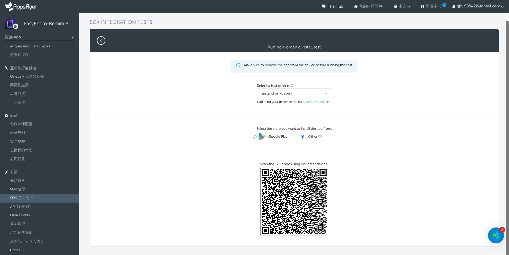

# 接入文档
## [AppsFlyer](https://dev.appsflyer.com/hc) 
+ 引入SDK
    ```
    repositories {
        mavenCentral()
    }
    dependencies {
        implementation 'com.appsflyer:af-android-sdk:6.3.2' 
    }
    //权限
    <uses-permission android:name="android.permission.INTERNET" />
    <uses-permission android:name="android.permission.ACCESS_NETWORK_STATE" />
    //混淆
    -keep class com.appsflyer.** { *; }
    -keep public class com.android.installreferrer.** { *; }
    ```
+ 启动SDK
    ```
    AppsFlyerLib.getInstance()
        .init(Constants.APPSFLYER_DEV_KEY, null, this)
        .apply { setDebugLog(BuildConfig.DEBUG) }
        .start(instance, Constants.APPSFLYER_DEV_KEY, object : AppsFlyerRequestListener {
            override fun onSuccess() {
                LogUtils.d("AppsFlyerLib启动成功")
            }

            override fun onError(code: Int, msg: String) {
                LogUtils.d("AppsFlyerLib启动失败（code = $code,msg = $msg）")
            }
        })
    ```
+ 已知问题
+ [测试](https://dev.appsflyer.com/hc/docs/testing-android)
    + 添加测试白名单(在Google Play下载`My Device ID by AppsFlyer`，并登录管理员账号注册或者在AppsFlyer测试功能下添加)

    + 测试非自然新增(白名单设备卸载APP后，扫描测试二维码，在网页点击Ready，白名单设备安装APP并打开，接下来就可以在控制面板中看到新增的非自然安装数量)
        
